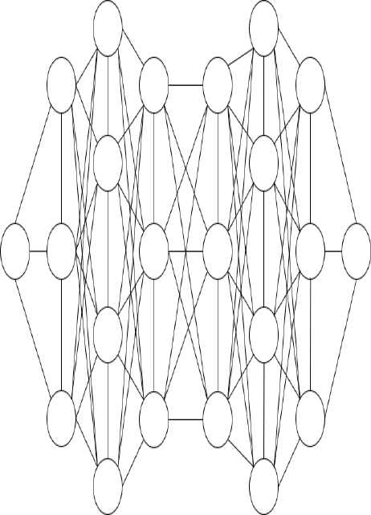

# Soccer Ball Outcome Prediction Project
This project aims to utilize Graph Neural Network to predict the results of soccer ball games based on the individual abilities of soccer players and the formation of all players. This model hopes to assist commercial event evaluation/guessing and team formation analysis, player scheduling, and ability training to achieve the goal of using technology to assist sports events.
 
## Key words
Graph Neural Network, Transformer, Ensemble

## Purpose of project
The original idea of this project came from my enthusiasm for sports events, and the approaching World Cup at that time. I thought it would be interesting to have a machine learning model that could predict the outcome of the game from the team formations announced before the game and FIFA's player ability ratings. The ultimate goal of this project is to use this model to assist commercial event evaluation and team formation analysis, player scheduling, and ability training to achieve the goal of using technology to assist sports events.

## Overview and comparison of existing related research
Compared with other machine learning fields, the research of graph neural networks are relatively unpopular, but the application of graph neural network is quite extensive nowadays. At present, it is mostly used in chemistry, transportation, and recommendation systems, and there is also related research on images, text, etc. [1]. Recently, there are related papers on the application of graph neural networks to the prediction of sports events [2], but the main research objects are American football and e-sports, and the research focuses on adding representations to the input graphs to improve the performance of the model, which is a little different from this project.

## Research methods
I divided the overall project architecture into three parts:
1. Graph conversion: For GNN, the input data must be in the form of a Graph, so before training, the unstructured data  (formations & player statistics) must be converted into graphs. Therefore, I convert each match into a graph, each of them will have 22 nodes, representing all players on the field (11 from the home team and 11 from the away team). More, there are edges connecting nodes to form the graph. The graph data processing is therefore divided into two parts:
    1. Node: A Node represents a player on the court, and each node will have 40 Features (i.e. X, Y, Height, Ball Skills, Defense…)
    2. Edge: To present the formation of the team, there will be edge connections between nodes. Edges will connect two adjacent nodes (side-to-side and front-to-back), and the node in the front will also be connected to the opponent's front node, completing the graph conversion of a single match.
    
2. Model training: After processing the conversion of graphs, model training will be carried out next. During this part, I imported hyperparameter search, adjusting parameters with different initializations like model depth, number of neurons, learning rate, etc.